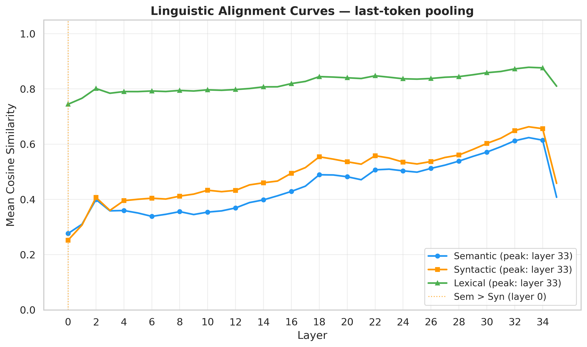
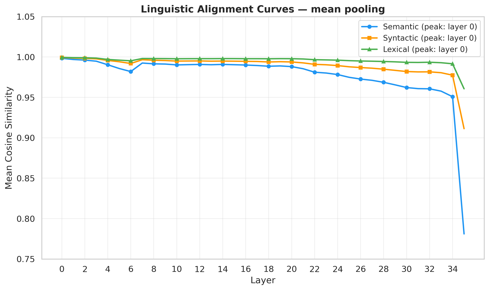
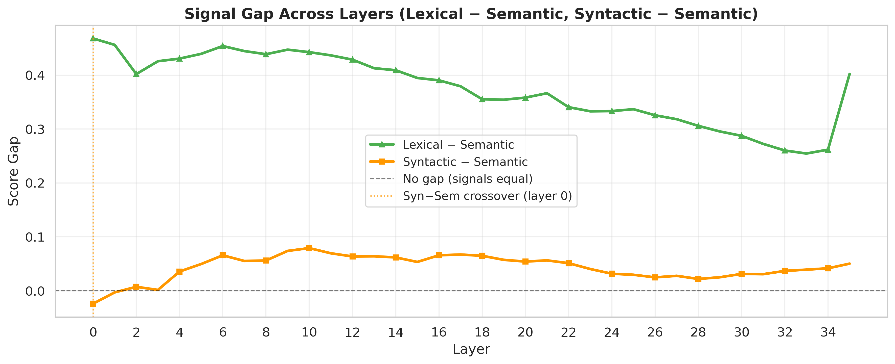
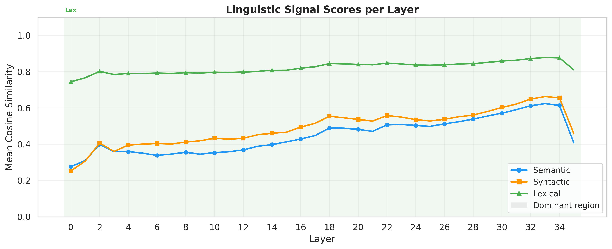

# Semantic vs Syntactic vs Lexical Alignment — Tiny Aya

---

## Dataset (English only, 3,000 pairs)

| Type | Definition | Example |
|---|---|---|
| **Lexical** | English synonym swaps | *"purchased" ↔ "bought"* |
| **Syntactic** | Same meaning, different grammar | *Active ↔ passive, cleft constructions* |
| **Semantic** | Same concept, different words (paraphrases) | *"The meeting was cancelled" ↔ "The meeting did not happen"* |

---

## Methodology
1. Run all sentences through **Tiny Aya (36 layers)** and extract layer-wise hidden states
2. Compute sentence embeddings via **mean pooling** and **last-token pooling** — compared empirically
3. Compute **cosine similarity** per pair per layer, averaged across all pairs per type
4. Derive alignment curves, signal gaps, layer specialization, and alignment transition layer

---

## Plots

*Layer-wise mean cosine similarity for Lexical, Syntactic, and Semantic pairs using last-token pooling. All three signals rise steadily and peak at layer 33 before collapsing at layer 35. Lexical dominates throughout (0.75→0.88); Syntactic and Semantic start near 0.25 and converge to ~0.66 and ~0.62 respectively. No crossover occurs at any layer.*

*Same curves with mean pooling. All three types cluster at ~0.99 similarity across all layers with no meaningful separation — confirming mean pooling is unsuitable for this analysis.*

*Pairwise score gaps between alignment types per layer. The Lexical−Semantic gap starts at ~0.46, narrows to ~0.25 in deeper layers, but never closes. The Syntactic−Semantic gap remains near zero throughout, showing these two types are almost indistinguishable from each other.*

*Per-layer signal scores with the dominant alignment type highlighted. Lexical is dominant (shaded green) across all 36 layers, with no layer where Syntactic or Semantic takes precedence.*

---
## Results

| Finding                | Observation                                                                        |
| ---------------------- | ---------------------------------------------------------------------------------- |
| **Mean pooling**       | Inflates all similarities to ~0.99 — no useful signal across layers                |
| **Last-token pooling** | Clear separation: Lexical 0.75→0.88, Syntactic 0.25→0.66, Semantic 0.25→0.62       |
| **Ordering**           | Lexical > Syntactic > Semantic holds at **every** layer — no crossover             |
| **Peak**               | All three signals peak at layer 33, collapse at layer 35 (output layer)            |
| **Gap trend**          | Lexical−Semantic gap narrows from ~0.46 → ~0.25 in deeper layers, but never closes |

---

## Conclusion
Tiny Aya never fully transitions from surface-level to semantic representations — lexical similarity dominates throughout all 36 layers. Last-token pooling is the correct method; mean pooling is insufficient. The synonym-swap design of lexical pairs sets a ceiling semantic pairs cannot reach — cross-lingual translation pairs would create sharper separation.

---

## Coverage Status

| Requirement (TIN-15)                                                 | Status                                                            |
| -------------------------------------------------------------------- | ----------------------------------------------------------------- |
| Lexical / Syntactic / Semantic pairs                                 | ✅ Done — 1,000 pairs each                                         |
| Steps 1–4: extraction → similarity → alignment curves                | ✅ Done                                                            |
| Layer specialization / dominant signal                               | ✅ Done                                                            |
| Alignment transition layer                                           | ✅ Done                                                            |
| Cross-language consistency `[("en","es"), ("en","hi"), ("en","ar")]` | ⏳ WIP — dataset is English-only                                   |
| Translation retrieval (MRR)                                          | ⏳ WIP — requires parallel cross-lingual pairs                     |
| Lexical as word translations (dog ↔ perro)                           | ⏳ WIP — current lexical pairs are synonym swaps, not translations |
